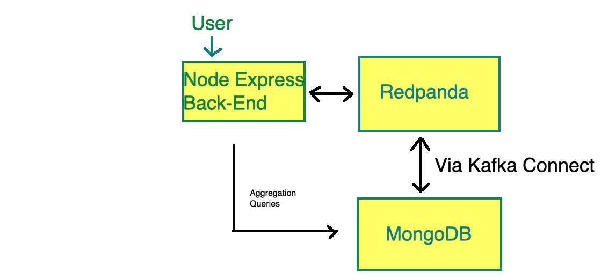

# Overview

This example showcases the integration between [Redpanda](https://vectorized.io/redpanda/), an open-source Kafka-compatible streaming platform and [MongoDB](https://www.mongodb.com/) the database for modern applications.  

To get started run `sh run.sh`

This will spin up the following containers:
- MongoDB single node (port 27017)
- RedPanda
- Kafka Connect with MongoDB Connector for Apache Kafka installed
- Node Server (hosting an Express) (port 4000)

 First, once your docker containers are up and running, you can configure the MongoDB Sink connect as follows:

 `curl -X POST -H "Content-Type: application/json" -d @mongodb-sink.json  http://localhost:8083/connectors`

Next, point your browser to 
http://localhost:4000

Click the Start button to start generating stock data.

